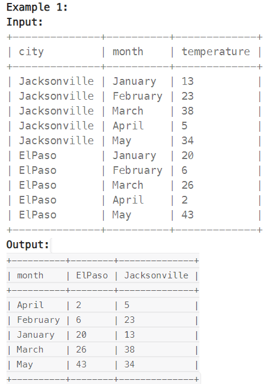
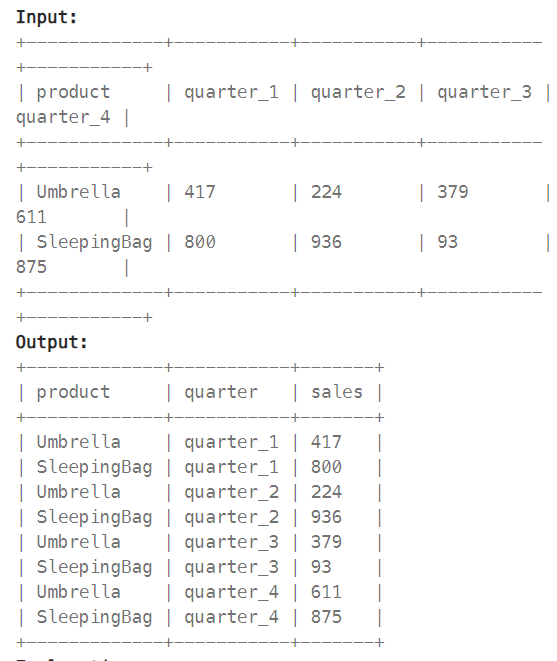

# Pandas Review

- [Data Structure](#data-structure)
- [Data Inspection](#data-inspection)
- [Data Selection AND Filtering](#data-selection-and-filtering)
- [String Methods](#string-methods)
- [Data Cleaning](#data-cleaning)
- [Data Reshaping](#data-reshaping)
- [Data Aggregation](#data-aggregation)
- [Merging and Joining](#merging-and-joining)
- [Data Reshaping](#data-reshaping)
- [File Input/Output](#file-inputoutput)
- [Time Series](#time-series)

## Data Structure

### DataFrame

- Two-dimensional labeled data structure, each column could be different data type

- Indexing: using 'loc' or 'iloc'

### Series

- One-dimensional array-like object

### Create DataFrame

```python
# set column one by one
df = pd.DataFrame(data = {'Name': ['Alice', 'Bob', 'Charlie'], 'Age': [25, 30, 35]})
# or
df = pd.DataFrame(data = [['Alice', 23], ['Bob', 18], ['Charlie', 20]], columns = ['Name', 'Age'])
```

## Data Inspection

- Shape of dataframe

```python
# row number
df.shape[0]
# col number
df.shape[1]
```

- First / Last Row

```python
# first N rows
df.head(N)
# last N rows
df.tail(N)
```

- Exact Row

```python
# Example, 5th row
df.iloc[4]
df.loc['label of 5th row']

# Example, 5th and 6th row
df.iloc[4:6]

# Example, 5th row 2-6 col
df.iloc[4, 2:7]
```

- Sort Value

```python
df.sort_values(by = ['col'], ascending = False, inplace = True)
```

- Rank

```python
df['rank'] = df['col'].rank(method = 'dense', ascending = False)
```

- Count

```python
df['col'].nunique()
```

- between

```python
df['col'].between(low, high)
```

## Data Selection AND Filtering

```python
# Select exact col
df[['col_1', 'col_2']]
# Select exact row
df[df['col_1'] > 100]
# Combine
df[['col_1', 'col_2']][df['col_1'] > 100]
# Multiple condition (or)
df[(df['col_1'] > 0) | (df['col_2'] > 0)]
# Multiple condition (and)
df[(df['col_1'] > 0) & (df['col_2'] > 0)]
# Not logical
df[~(df['col_1'] > 0)]
# In the list (Series)
df[df['col_1'].isin(df_2['col_1'])]
# Update via condition
df['new_col'] = np.where(condition, True_value, False_value)
```

## String Methods

- String Length

```python
df['str'].str.len()
```

- Specific Character

```python
# The first character
df['str'].str[0]
```

- Capitalize (Name)

```python
df['col'].str.capitalize()
```

- Including (Contain)

```python
# Start with xxx
df['col'].str.contains('\\bxxx')
# standlone word
df['col'].str.contains(r'\sxxx\s')
```

- Match

```python
# Exactly xxx
df['col'].str.match('xxx')
```

### Regex Pattern

Valid Email Example: 

- ^: Anchor the regex pattern to match from the start of the string.

- [A-Za-z]: Match any single uppercase or lowercase letter. The email prefix name must start with a letter.

- [A-Za-z0-9_.-]*: Match any number of characters following the first letter in the email prefix name. It includes letters (upper or lower case), digits, underscore '_', period '.', and/or dash '-'.

- @: Match the literal '@' character, which separates the prefix name and the domain.

- leetcode: Match the literal 'leetcode', which is part of the email domain.

- (?com)?: Make the sequence ?com optional in the email domain. Allows the pattern to match both '@leetcode.com' and '@leetcode?com'.

- . : Match the literal '.' character, which separates the 'leetcode' part from the 'com' part of the domain.

- com: Match the literal 'com' at the end of the email domain.

- $: Anchor the regex pattern to match until the end of the string.

- Example:

```python
users[users['mail'].str.match(r'^[A-Za-z][A-Za-z0-9_\.\-]*@leetcode(\?com)?\.com$')]
```

## Data Cleaning

### Drop Duplicate

https://pandas.pydata.org/docs/reference/api/pandas.DataFrame.drop_duplicates.html

```python
df.drop_duplicates()
# Only drop from specific Row
df.drop_duplicates(subset = ['col'])
```

### Drop Missing Data

https://pandas.pydata.org/docs/reference/api/pandas.DataFrame.dropna.html

```python
df.dropna()
# Only drop from specific Row
df.dropna(subset = ['col'])
```

### Modify Col (Add Col)

https://pandas.pydata.org/docs/reference/api/pandas.DataFrame.rename.html

```python
df['col'] = df['col'] * 2
df['new_col'] = df['col'] * 2
```

### Change Type

```python
df['col'] = df['col'].astype(int)
```

### Rename Col

```python
df.rename(columns = {'old_col_1': 'new_col_1', 'old_col_2': 'new_col_2'}, inplace = True)
```

### Fill Missing Data

https://pandas.pydata.org/docs/reference/api/pandas.DataFrame.fillna.html

```python
df.fillna(value = 0, inplace = True)
# or exact col
df['col'] = df['col'].fillna(0)
```

## Data Reshaping

### Concatenate multiple dataframe

https://pandas.pydata.org/docs/reference/api/pandas.concat.html

```python
new_df = pd.concat(df1, df2, axis = 0)
```

### Pivot

https://pandas.pydata.org/docs/reference/api/pandas.pivot_table.html



```python
# Example
pd.pivot_table(weather, values = 'temperature', index = ['month'], columns = ['city'], aggfunc = 'sum')
```

### Melt

https://pandas.pydata.org/docs/reference/api/pandas.melt.html



```python
# Example
pd.melt(report, id_vars = ['product'], value_vars = ['quarter_1', 'quarter_2', 'quarter_3', 'quarter_4'])
```

## Data Aggregation

```python
# Try to use reset_index() all the time, or 'col' will be index
df.groupby('col').reset_index()
```

### Aggregate method

https://pandas.pydata.org/docs/reference/api/pandas.DataFrame.agg.html

```python
df.groupby('col').agg(method).reset_index()
# or
df.groupby('col').agg(
    new_col = ('old_col', method)
)
```

- Aggregate these functions over the rows.

```python
df.groupby('col').agg([
    ('new_col1', 'sum'),
    ('new_col1', lambda x: ','.join(sorted(x.unique())))
]).reset_index()
```

- Different aggregations per column

```python
df.groupby('col').agg({
    'old_col1': 'min'
    'old_col2': 'nunique'
}).reset_index()
```

- Aggregate different functions over the columns and rename the index of the resulting DataFrame.

```python
df.agg(x=('A', 'max'), y=('B', 'min'), z=('C', 'mean')).reset_index()
```

### Count

```python
df.groupby('col').nunique().reset_index()
df.groupby('col').count().reset_index()
```

## Merging and Joining

https://pandas.pydata.org/docs/reference/api/pandas.merge.html

```python
# using on for col in both df, or (left_on, right_on) for different col name
pd.merge(left_df, right_df, how = 'inner', on = 'id')
# on could use more than one col
# on = ['col_1', 'col_2']
```

## File Input/Output

Data Format Support

- CSV

- Excel

- JSON

- SQL

- HDF5

### Read

```python
# read_(format)
df = pd.read_csv('file.csv')
```

### Write

```python
#to_(format)
df.to_excel('file.xlsx', index = False)
```

### Read from SQL database

```python
from sqlalchemy import create_engine
# Create a connection to a SQL database
engine = create_engine('sqlite:///my_database.db')

# Read data from SQL via query
sql_df = pd.read_sql_query('SELECT * FROM my_table', con=engine)
```

## Time Series

### Data Range Generation

```python
dates = pd.date_range(start='2020-01-01', end='2020-01-10', freq='D')
```

### Frequency Conversion

https://pandas.pydata.org/docs/reference/api/pandas.DataFrame.resample.html

```python
monthly_data = daily_data.resample('M').mean()
```

### Moving Window Statistics

https://pandas.pydata.org/docs/reference/api/pandas.DataFrame.rolling.html

```python
rolling_mean = df['data_column'].rolling(window=5).mean()
```

### Date Shifting and Lagging

https://pandas.pydata.org/docs/reference/api/pandas.DataFrame.shift.html

```python
# Shifting data by one day forward
df['shifted_data'] = df['data_column'].shift(1)

# Creating a lagged feature
df['lagged_data'] = df['data_column'].shift(-1)
```